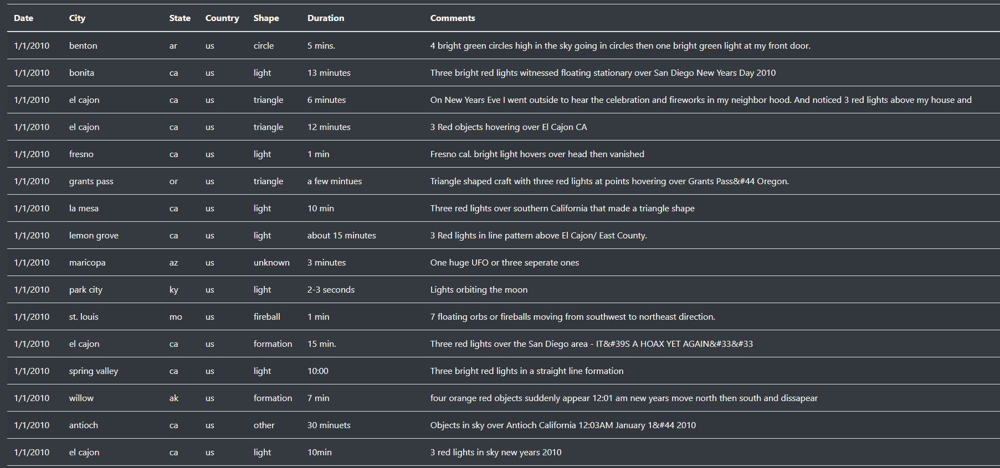
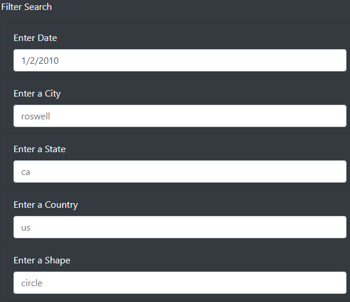
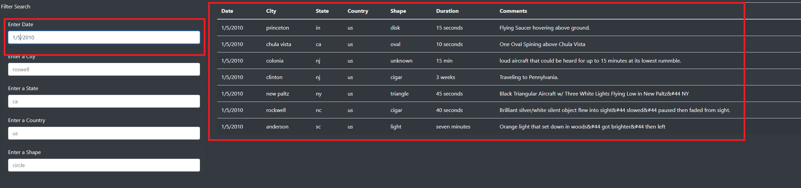
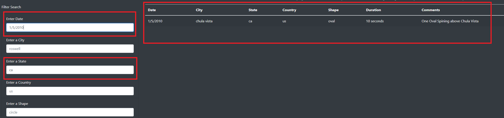
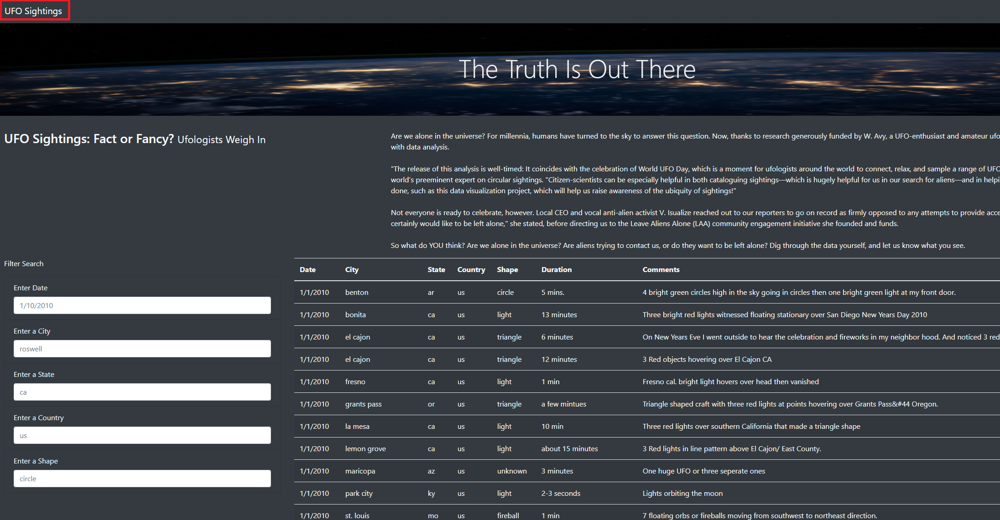

# UFOs

## Overview of the analysis
The purpose of this analysis is to help Dana create a webpage that has dynamic tables to provide more in depth analysis of UFO sightings. The website will allow users to filter for multiple criteria at the same time. The filtered data includes the following:

- date
- city
- state
- country 
- shape

## Results
The main webpage shows all the UFO sighting data onto an unfiltered table. The data is shown below:

On the bottom left corner of the webpage, there is a filter where a user can filter based on date, city, state, country, and shape of the UFO sighting. The picture below shows the filter search bar.

To filter the data based on the specific category, the user can type in the field and press the Enter key. Below is the data filtered by "Date" of "1/5/2010"

To filter data based on two different category, the user can type in two fields and press the Enter key. Below is the data filtered by the "Date" of 1/5/2010" and "State" of "ca"

By clicking "UFO Sightings" at the top left corner, the table and filters can be reset so a new data search can be completed.

## Summary

